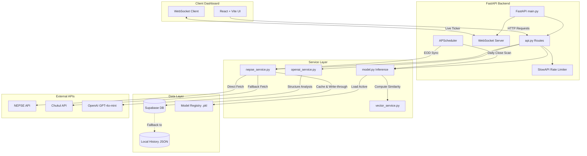

# Trade Signal AI - Core Brain Map

This document maps the end-to-end architecture, data flows, machine learning models, and AI reasoning pipelines powering **Trade Signal AI**.

---

## 1. Data Pipeline & Sync Engine (`nepse_service.py`)

The data pipeline connects to the Nepal Stock Exchange (NEPSE) and provides robust, write-through caching to Supabase.

*   **Multi-Tiered Caching:** Ticker data, market summaries, top gainers/losers, indices, and daily prices are cached with separate TTLs.
*   **Write-Through Cache:** When `get_stock_chart(symbol)` is called, the system:
    1.  Queries Supabase `daily_ohlcv` (limit 730 days) to minimize database egress.
    2.  Resolves the NEPSE `securityId` from an in-memory cache or falling back to live today-price data.
    3.  Fetches recent historical chunks from the NEPSE API.
    4.  Upserts new data back to Supabase (`stocks` and `daily_ohlcv` tables).
*   **Data Healing:** Resolves zero open prices (commonly returned by the NEPSE API) using the previous day's close instead of the current day's close. This prevents artificial "Doji" candle errors.
*   **API Resilience:** Fallback to the Chukul API is triggered automatically if the primary NEPSE API is offline or unresponsive.
*   **Correct Weekend Schedule:** Refined to align with NEPSE's official Monday–Friday trading days and Saturday–Sunday weekend schedule, preventing system failures on Friday sessions or false lookups on Sundays.

---

## 2. Machine Learning Engine (`model.py`)

The ML pipeline manages model training, registry management, regime detection, and backtesting.

### Feature Engineering (42+ Technical Indicators)
The system calculates key technical features including:
*   **Trend:** SMA (50, 200), EMA (9, 21), and EMA Crossovers.
*   **Momentum:** RSI (14), Stochastic Oscillator (%K, %D), MACD, MACD Signal, MACD Hist, and Momentum (5, 10 days).
*   **Volatility:** Bollinger Bands (Upper, Lower, Width, %B), ATR, and 20-day standard deviation.
*   **Volume:** Volume change percentage, Volume ratios, and On-Balance Volume (OBV).
*   **Regime/Structure:** Support/Resistance boundaries, 52-week price range percentages, and candlestick body size.

### Ensemble Inference
*   **Market Regime Detection:** Classifies the current market into **Bearish**, **Ranging**, or **Bullish** using a Gaussian Mixture Model (GMM).
*   **Regime-Specific Experts:** Routes prediction tasks to dedicated sub-models trained on corresponding regimes (e.g., Random Forest or XGBoost models fine-tuned for low-volatility ranges).
*   **Temporal iTransformer:** Optionally ensembles the tree-based models with a PyTorch-based iTransformer (70% Trees / 30% Transformer weight) for sequence-aware predictions.
*   **Decision Confidence:** A signal is only issued if prediction probability exceeds the **65% confidence threshold**; otherwise, it falls back to **HOLD** to protect capital.
*   **Explainability:** Integrates SHAP values to extract and display the top 3 features driving the model's decision in real-time.
*   **Vector Similarity Bank:** Matches the current 30-day technical signature to historical NEPSE milestones (e.g., *2021 All-Time High Peak* or *2022 Bear Market Bottom*) using cosine similarity.

---

## 3. AI Explanation & Prompt Service (`openai_service.py`)

Bridges the quantitative model results and qualitative trade suggestions for users.

*   **Context Injection:** Injects technical indicators, market regimes, current price levels, and news sentiment index scores into the prompt context.
*   **Structured JSON Output:** Uses `gpt-4o-mini` with strict system instructions to guarantee a valid JSON response containing `explanation`, `market_structure`, `ideal_entry`, target boundaries, stops, and risk notes.
*   **Algorithmic Fallbacks:** If the OpenAI API key is missing, or if request rates are exceeded, the system automatically falls back to an internal mathematical engine. This local engine derives logical entries, stops, and targets from ATR and Support/Resistance lines, ensuring the application never crashes.

---

## 4. Background Scheduler (`scheduler.py`)

Ensures the backend remains updated autonomously:
*   **EOD OHLCV Dump:** Runs every weekday at 15:15 NPT, pulling the entire day's transactions in a single batch API call.
*   **Daily Predictions Scan:** Loops through active stocks with an `asyncio.Semaphore(10)` to perform parallel predictions without hitting NEPSE rate limits.
*   **Model Retraining:** Scheduled weekly to incorporate new historical data and update the active model registry file.

---

## 5. End-to-End Verification Results

An automated system verification test was conducted on **July 1, 2026**, checking all subsystems:

1.  **Supabase Connection:** **SUCCESS**
    *   Successfully established database connection and retrieved stock symbols (e.g., `GBIME`, `HPPL`, `SGHC`).
2.  **NEPSE API Fetch:** **SUCCESS**
    *   Retrieved index data and market status.
    *   Successfully resolved the security ID of `SHIVM` (Shivam Cements) via fallback and fetched 268 trading days of historical data.
    *   Successfully saved 223 new historical rows back to Supabase using the write-through cache.
3.  **Model Prediction:** **SUCCESS**
    *   Successfully computed all 42 indicators for `SHIVM`.
    *   Loaded the global ensemble model (`model_xgb_20260513_233014.pkl`).
    *   Predicted a **BUY** signal with **75.5% confidence** (exceeding the 65% threshold).
    *   Detected a **Ranging** market regime.
    *   Found a **74% cosine similarity match** to the *2021 All-Time High Peak* pattern.
4.  **OpenAI Service:** **SUCCESS**
    *   Successfully generated a professional trade breakdown via `gpt-4o-mini`.
    *   Identified ideal entry at Rs. 995.0, Stop Loss at Rs. 950.0, and generated structured paragraphs explaining the trade logic, structure, and risk factors.

**System Status: 100% Operational & Verified**
